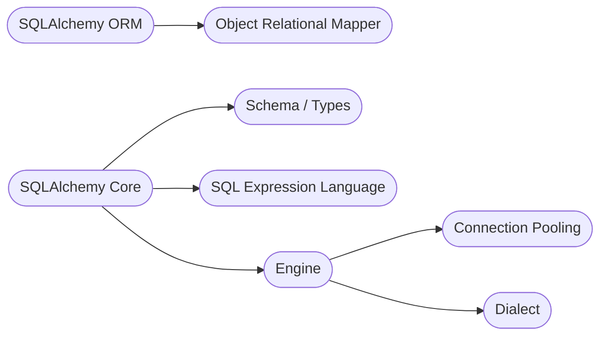

# 1. SQLAlchemy 入门

[[TOC]]

::: info 版本要求

本教程针对 SQLAlchemy 2.x+，如果需要 SQLAlchemy 1.x 的教程请访问官方文档。

本教程要求使用 Python 3.7+，最佳版本是 Python 3.10+，请使用尽可能新的 Python 以确保特性支持。

:::

## 1.1 什么是 SQLAlchemy

<div class="no-link">

[](https://pypi.org/project/sqlalchemy)
[](https://pypi.org/project/sqlalchemy)
[](https://pypi.org/project/sqlalchemy)

</div>

SQLAlchemy 是 Python 生态中久经考验的数据库驱动和 ORM 框架，自 SQLAlchemy 1.4 开始，SQLAlchemy 就支持了异步操作。2022 年 11 月，SQLAlchemy 发布了 2.0 版本，其中大量 API 进行更改，C 扩展全部用 Cython 重写，相比以前对类型注解、异步等有更好的支持。

SQLAlchemy 的 `asyncio` 支持依赖于 `greenlet` 项目。这个依赖将默认安装在常见的机器平台上，但不是每个架构都支持，也可能不会默认安装在不太常见的架构上。

SQLAlchemy 的核心功能包括 ORM 模块 和 Core 模块。



通过 `pip` 安装 SQLAlchemy：

```bash
pip install SQLAlchemy
```

查看当前安装的版本：

```bash
python -c "import sqlalchemy;print(sqlalchemy.__version__)"
```

或者

```bash
pip list | grep SQLAlchemy
```

## 1.2 SQLAlchemy 支持的数据库

SQLAlchemy 对常见数据库均有支持，下表截至 2.0.4 版本[^1]

[^1]: Dialects，SQLAlchemy，<https://docs.sqlalchemy.org/en/20/dialects/index.html>

| 数据库               | 测试通过的版本             | 常规支持   | 最佳    |
| -------------------- | -------------------------- | ---------- | ------- |
| Microsoft SQL Server | 2017                       | 2012+      | 2005+   |
| MySQL / MariaDB      | 5.6, 5.7, 8.0 / 10.4, 10.5 | 5.6+ / 10+ | 5.0.2+  |
| Oracle               | 11.2, 18c                  | 11+        | 9+      |
| PostgreSQL           | 9.6, 10, 11, 12, 13, 14    | 9.6+       | 9+      |
| SQLite               | 3.21, 3.28+                | 3.12+      | 3.7.16+ |
